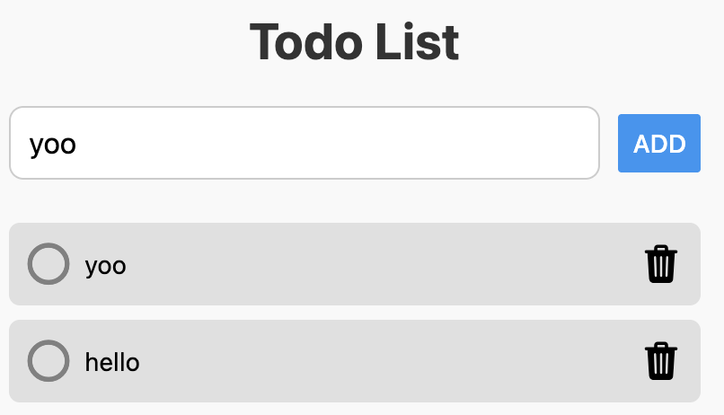
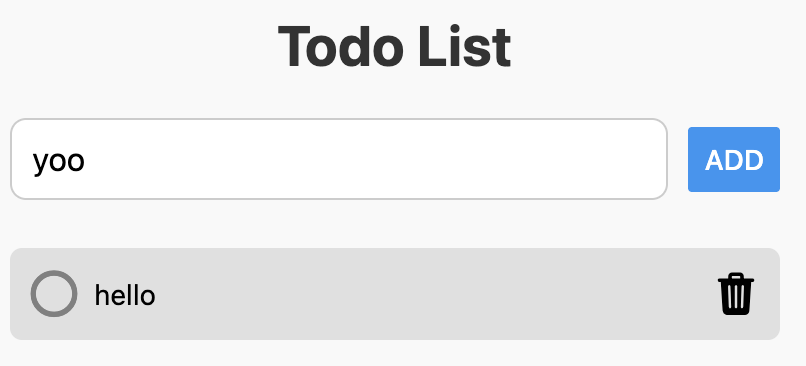

# Todo Lists

## Get started

1. Install dependencies

   ```bash
   npm install
   ```

2. Start the app

   ```bash
   npx expo start
   ```

## Overview
The Todo Notes App is a task management application that allows users to create, update, delete, and manage their tasks efficiently. 

## Walkthrough
1. Add lists


2. Delete lists


## Technologies Used
- React Native: For building the user interface.
- Firebase Firestore: For real-time data storage and synchronization.
- Expo: For simplifying the development and testing process.
- TypeScript: For type safety and better code maintainability.
