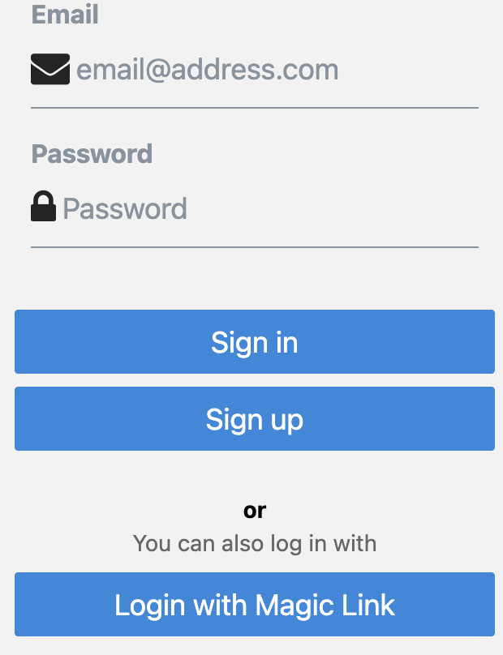
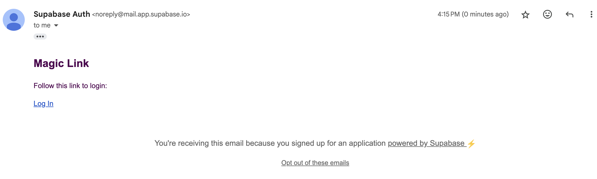

## Lab Report 2: User Authentication with Supabase in React Native (Magic Link)

### Objective
The objective of this task was to implement a Magic Link login system in a React Native app using Supabase as the authentication backend. Users should be able to enter their email addresses and receive a login link via email that grants them access to the app without needing to remember a password.

### Tools Used
- React Native (with Expo)
- Supabase
- TypeScript
- React Native Elements (RNEUI)
- AsyncStorage

### Explanation:
- In this magic link component Supabase's OTP authentication is used to send a Magic Link to the user's email.
- The signInWithMagicLink function sends the Magic Link when the user clicks the button.
- The loading state is managed to show progress while the link is being sent.
- On successful submission, an alert tells the user to check their email for the Magic Link.
- Error handling is done using Alert.alert() to show any issues if they arise (e.g., invalid email).

### Results
1. The user is presented with the option to log in using a Magic Link (email-based login without password).

2. The user enters their email address to receive a Magic Link.

3. The user receives an email with the Magic Link and clicks it to authenticate and access the app.

### Conclusion
This magic link component showcased the implementation of secure, passwordless authentication in a mobile app using Magic Links with Supabase and React Native. By leveraging Supabase’s built-in OTP flow and AsyncStorage for session persistence, the process was streamlined, efficient, and user-friendly.

