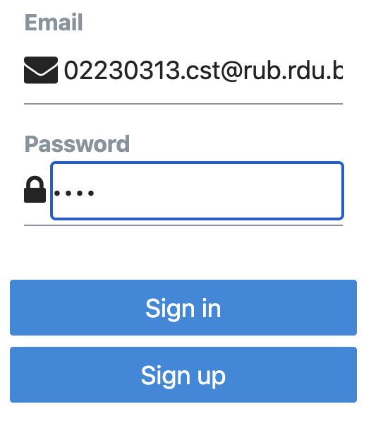

## Lab Report 2: User Authentication with Supabase in React Native (using email and password authenticatoion)

### Objective
Create a mobile app using React Native and Supabase that allows users to sign up, log in, view, and update their profile using email and password.

### Tools Used
- React Native (with Expo)
- Supabase
- TypeScript
- React Native Elements (RNEUI)
- AsyncStorage

### Steps
1. Create App
- Initialized a new Expo app with TypeScript:
```
npx create-expo-app -t expo-template-blank-typescript expo-user-management
cd expo-user-management
```

2. Install Dependencies
```
npx expo install @supabase/supabase-js 
```

```
@react-native-async-storage/async-storage @rneui/themed
```

3. Set Up Supabase
- Created a supabase.tsx file to connect the app with Supabase and enable session storage using AsyncStorage.

4. Build Auth Component
- Users can sign up and log in with email/password using a simple UI built with RNEUI.

5. Build Account Component
- Users can view and edit their profile info (like username and website). Data is stored in Supabase.

6. Manage Session
- App.tsx checks for existing sessions, restores them using AsyncStorage, and updates in real-time on login or logout—so users stay logged in without repeating the process.

7. Run the App
- Use npm start to launch.

### Results
- Users can sign up, log in


- manage their profile.


- Sessions are saved in and refreshed automatically using AsyncStorage.


### Conclusion
This lab shows how to build a working user authentication system using Supabase and React Native. The process was simple and effective, with persistent sessions and clean UI.